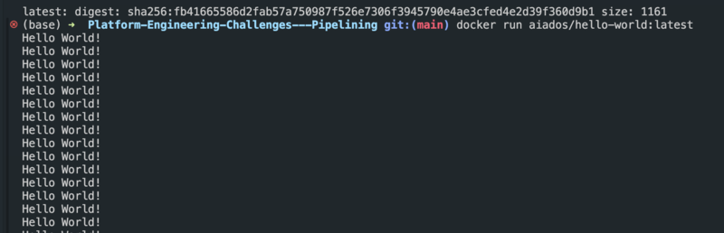
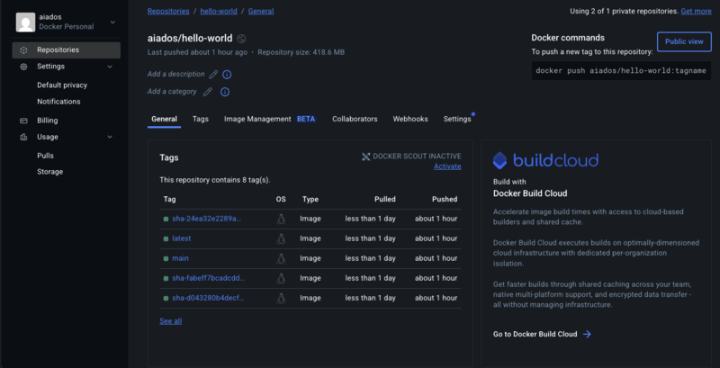
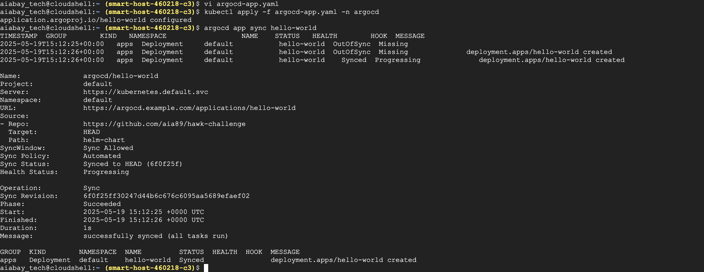
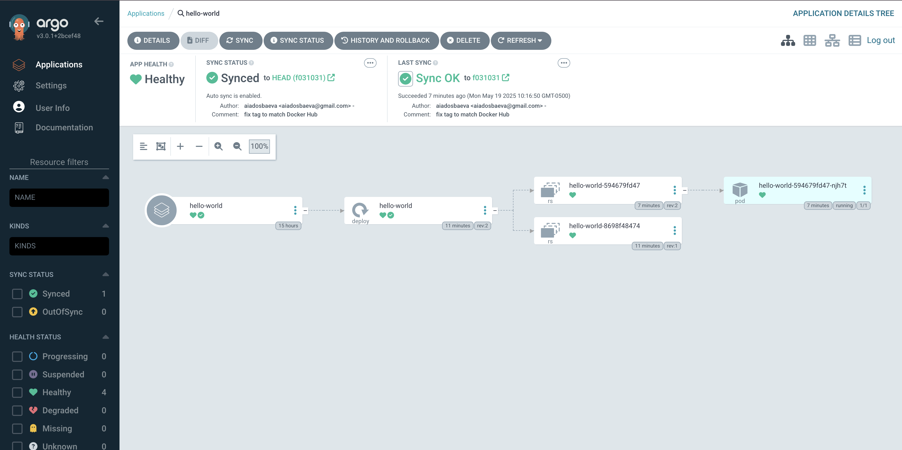

# my-pipeline

## Tech Stack

- GitHub Actions – CI pipeline for building, testing, and pushing Docker image
- Docker – Containerized Java application
- Kubernetes – Runtime environment
- Helm – Application packaging and deployment
- ArgoCD – GitOps-based continuous delivery
- GKE (Google Kubernetes Engine) – Hosted cluster


## CI/CD Pipeline Flow

1. **Developer pushes to GitHub (`main`)**
2. **GitHub Actions** triggers:
   - Builds `.jar` from Java app
   - Runs basic unit tests
   - Builds & tags Docker image (`<repo>:<commit-sha>`)
   - Pushes image to Docker Hub
   - Updates the `values.yaml` in Helm chart with new image tag
3. **ArgoCD detects change in Git**
   - Syncs Helm chart automatically
   - Deploys updated app to Kubernetes
   - Cluster pulls latest Docker image
  
   

Build and Test the Java 

run from cli:

```
./gradlew build
./gradlew clean build
```
 

>BUILD SUCCESSFUL in 396ms
7 actionable tasks: 7 up-to-date

``` 
./gradlew test
```

>BUILD SUCCESSFUL in 262ms
3 actionable tasks: 3 up-to-date


### Build docker:

```
git:(main) docker build -t hello-world-app .
docker images
REPOSITORY    TAG       IMAGE ID       CREATED         SIZE
hello-world   latest    72b7e32a0196   6 seconds ago   402MB

git:(main) docker tag hello-world yourusername/hello-world:latest
git:(main) docker push aiados/hello-world:latest
```



## Trigger the GitHub Actions Pipeline
Push your changes to the main branch: 
```
git add .
git commit -m "Trigger pipeline"
git push origin main
```
Then go to your GHA tab in your repo and check the pipeline


## Verify Docker Image on Docker Hub




Check your Docker Hub account for a new image tagged with the latest commit SHA.

## Your GitHub Actions pipeline should:

 -Automatically update the image.tag in helm-chart/values.yaml
 
 -Commit that update back to the repo
 
 -You should see this commit in your Git history

##  Sync & Deploy (via ArgoCD)
ArgoCD watches the repo for changes and will automatically sync the updated Helm chart and deploy your app to Kubernetes.

You can verify this in the ArgoCD UI or via CLI:
```
argocd app get hello-world
```
 

 

### Next-Check helm
                   
``` 
(base) ➜ git:(main) cat helm-chart/values.yaml | grep -A2 "image:"
```
> image:
  repository: docker.io/aiados/hello-world
  tag: latest


##  ArgoCD App Configuration
```
apiVersion: argoproj.io/v1alpha1
kind: Application
metadata:
  name: hello-world
  namespace: argocd
spec:
  project: default
  source:
    repoURL: https://github.com/aia89/hawk-challenge.git
    targetRevision: HEAD
    path: helm-chart
  destination:
    server: https://kubernetes.default.svc
    namespace: default
  syncPolicy:
    automated: {}
```

# Last part 
Trigger ArgoCD to auto-sync as soon as there's a push to main.

## Prerequisites:

-For this we need our Argocd be publicly accessible via LoadBalancer (which i have)

-Our ArgoCD app should be set to automated sync (from our CLI - which i did earlier)

-Must have a repo:  https://github.com/aia89/hawk-challenge

1. Add a webhook in github settings make sure specify ArgoCDs ip address
   
2. Test. (make any change in readme and it should trigger ArgoCD automatically)

    

